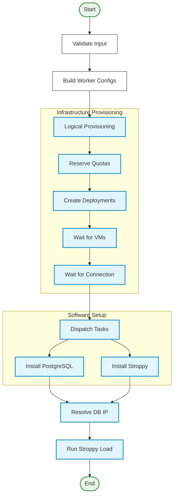

# Hatchet Workflow

This repository contains workflows and tools for automating testing and provisioning using [Hatchet](https://hatchet.run/). It orchestrates the deployment of infrastructure (VMs, networks), installation of software (PostgreSQL, Stroppy), and execution of performance tests.

## Overview

The system is designed to run automated tests (specifically Stroppy tests) on cloud infrastructure. It uses Hatchet workflows to manage the lifecycle of these tests, from provisioning resources to gathering results.

### Key Components

*   **Hatchet Workflows**: Define the sequence of tasks for testing.
*   **Crossplane Integration**: Used for provisioning cloud resources (VMs, Networks) on Yandex Cloud.
*   **Stroppy**: A testing tool for databases, used here to generate load and verify performance.
*   **Edge Workers**: Go binaries that run on the provisioned VMs to execute tasks locally (e.g., installing software, running the database, running the test).

## Workflow Architecture

The testing process is broken down into several nested workflows to ensure modularity and error handling.

### 1. Test Suite Workflow (`stroppy-test-suite`)

This is the entry point. It accepts a suite of tests and runs them in parallel.

*   **Input**: A list of test configurations (e.g., different workloads, database versions).
*   **Process**:
    1.  Validates the input.
    2.  Spawns a `stroppy-test-run` workflow for each test case using `RunMany`.
    3.  Waits for all child workflows to complete.
    4.  Aggregates results.

### 2. Test Run Workflow (`stroppy-test-run`)

This workflow manages a single test execution. It coordinates the infrastructure and the test itself.



**Steps:**

1.  **Validate Input**: Checks if the test configuration is valid.
2.  **Build Workers**: Determines the necessary worker configurations (e.g., one DB worker, one Stroppy client worker) based on the test requirements.
3.  **Provision Workers**: Calls the `cloud-provision` workflow to create the actual VMs.
4.  **Install Software**: Instructs the newly created edge workers to install necessary software (PostgreSQL, Stroppy) via `edge-worker` tasks.
5.  **Run Stroppy**: Commands the Stroppy worker to execute the test against the Database worker.

### 3. Provision Workflow (`cloud-provision`)

Handles the interaction with the cloud provider (Yandex Cloud via Crossplane).

*   **Logical Provisioning**: Generates unique IDs and names for networks and VMs.
*   **Reserve Quotas**: Checks and reserves necessary cloud quotas.
*   **Create Deployments**: Applies Crossplane resources to the cluster to create VMs.
*   **Wait**: Waits for VMs to be up and for the `edge-worker` binary on them to connect back to the Hatchet server.
*   **Failure Handling**: Includes logic to destroy resources if provisioning fails.

## Technical Details

### Edge Workers

The `cmd/edge-worker` binary is deployed to the provisioned VMs. It acts as a local agent that:
*   Connects to the Hatchet server.
*   Registers itself with specific capabilities (e.g., `SETUP_SOFTWARE`, `RUN_STROPPY`).
*   Executes tasks dispatched by the main workflow (e.g., `apt-get install`, running `stroppy`).

### Configuration

The system is configured via YAML files (see `examples/nightly/workflow.yaml`) and environment variables.

**Key Environment Variables:**
*   `HATCHET_CLIENT_TOKEN`: Token for authenticating with Hatchet.
*   `HATCHET_CLIENT_HOST_PORT` / `HATCHET_CLIENT_SERVER_URL`: Hatchet server address.

### Running a Test

To run a test manually:

1.  Ensure you have a Hatchet server running.
2.  Configure your `examples/nightly/workflow.yaml` with the correct Hatchet connection details.
3.  Run the CLI tool:
    ```bash
    go run cmd/run/main.go --file examples/nightly/workflow.yaml
    ```

## Directory Structure

*   `cmd/`: Entry points for binaries (`run`, `edge-worker`, `master-worker`).
*   `internal/domain/workflows`: Workflow definitions (`stroppy`, `provision`, `edge`).
*   `internal/proto`: Protocol buffer definitions for data structures.
*   `examples/`: Example workflow configurations.
