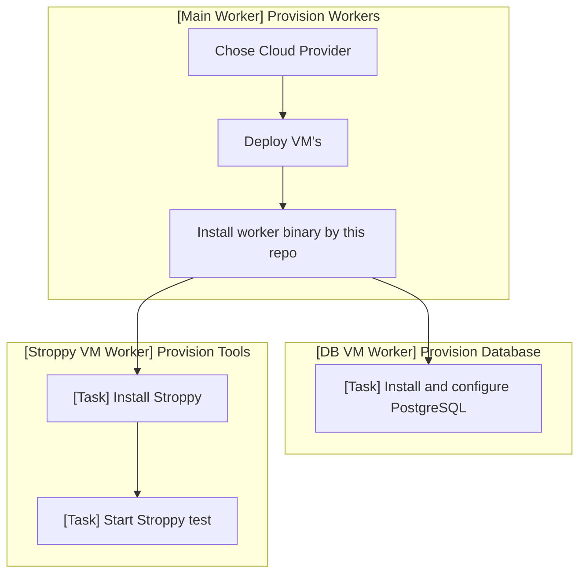

```mermaid
flowchart TD
    
    subgraph Phase1["[Main Worker] Provision Workers"]
        A[Chose Cloud Provider] --> B[Deploy VM's]
        B --> C[Install worker binary by this repo]
    end

    subgraph Phase2["[DB VM Worker] Provision Database"]
        I["[Task] Install and configure PostgreSQL"]
    end
    
    subgraph Phase3["[Stroppy VM Worker] Provision Tools"]
        M["[Task] Install Stroppy"] --> N["[Task] Start Stroppy test"]
    end
    
    C-->I
    C-->M
```