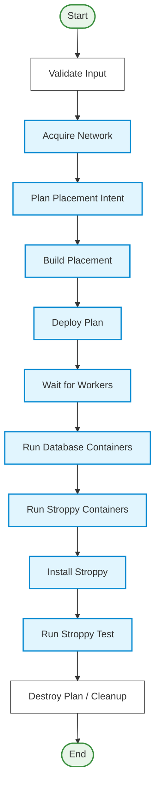

# Hatchet Workflow

This repository contains workflows, tools, and a web interface for automating testing and provisioning using [Hatchet](https://hatchet.run/). It orchestrates the deployment of infrastructure (VMs, networks), installation of software (PostgreSQL, Stroppy), execution of performance tests, and provides an interactive web UI.

## Overview

The system runs automated tests (specifically Stroppy tests) on cloud infrastructure. It uses Hatchet workflows to manage the lifecycle of these tests, from provisioning resources to gathering results. We've introduced a web interface to visualize and manage these workflows more intuitively.

### Key Components

*   **Hatchet Workflows**: Define the sequence of tasks for testing (written in Go).
*   **Web UI**: A React + TypeScript + Vite frontend (`web/`) for monitoring and interacting with the system.
*   **Valkey**: Used in the application stack as a fast, reliable datastore.
*   **Terraform Integration**: Used for provisioning cloud resources (VMs, Networks) on Yandex Cloud.
*   **Stroppy**: A testing tool for databases, used here to generate load and verify performance.
*   **Edge Workers**: Go binaries that run on the provisioned VMs to execute tasks locally (e.g., installing software, running the database, running the test).

## Getting Started

The project ships with a `Makefile` and Docker Compose environments to make local development easier.

### Prerequisites

*   Docker & Docker Compose
*   Go 1.25+
*   Node.js & npm/yarn/pnpm (for the frontend)
*   Hatchet instance (local or remote)

### Local Development

1. **Start the Infrastructure Components:**
   Run the following command to spin up required infrastructure services (e.g. Valkey) in the background:
   ```bash
   make up-infra
   ```

2. **Start the Dev Environment:**
   Start the backend workers and master services locally via Docker:
   ```bash
   make up-dev
   ```
   *(To stop the infra or dev setups, you can use `make down-infra` or `make down-dev` respectively. To clean volumes, use `make clean-infra` or `make clean-dev`)*

3. **Start the Web UI:**
   In a separate terminal, run the React frontend:
   ```bash
   cd web
   npm install # or yarn install
   npm run dev # or yarn dev
   ```

## Workflow Architecture

The testing process is broken down into several nested workflows to ensure modularity and error handling.

### 1. Test Suite Workflow (`stroppy-test-suite`)

This is the entry point. It accepts a suite of tests and runs them in parallel.

*   **Input**: A list of test configurations (e.g., different workloads, database versions).
*   **Process**:
    1.  Validates the input.
    2.  Spawns a `stroppy-test-run` workflow for each test case using `RunMany`.
    3.  Waits for all child workflows to complete.
    4.  Aggregates results.

### 2. Test Run Workflow (`stroppy-test-run`)

This workflow manages a single test execution. It coordinates the infrastructure and the test itself.



**Steps:**

1.  **Validate Input**: Checks if the test configuration is valid.
2.  **Provision Flow**: A linear sequence that acquires a network, plans, and builds a resource placement strategy, and then enacts it (`Deploy Plan`) using Terraform.
3.  **Wait for Workers**: Halts execution until all edge worker instances connect to the Hatchet backend.
4.  **Container & Software Setup**: Sequentially starts DB and Stroppy Docker containers, then runs the Stroppy installation on target hardware.
5.  **Run Stroppy Test**: Fires the main load-generating test and gathers the statistics.
6.  **Cleanup**: Triggers `Destroy Plan` to dispose of Terraform-managed infrastructure upon success or failure.

### 3. Provision Workflow (`cloud-provision`)

Handles the interaction with the cloud provider (Yandex Cloud via Terraform).

*   **Logical Provisioning**: Generates unique IDs and names for networks and VMs.
*   **Reserve Quotas**: Checks and reserves necessary cloud quotas.
*   **Create Deployments**: Applies Terraform configurations to provision VMs and networks.
*   **Wait**: Waits for VMs to be up and for the `edge-worker` binary on them to connect back to the Hatchet server.
*   **Failure Handling**: Includes logic to destroy resources if provisioning fails.

## Directory Structure

*   `cmd/`: Entry points for Go binaries (`run`, `edge-worker`, `master-worker`).
*   `deployments/`: Dockerfiles and deployment configurations.
*   `examples/`: Example workflow configurations (e.g., YAML configurations).
*   `internal/`: Core business logic, separated by domain (`workflows`, `core`, `infrastructure`).
*   `internal/proto`: Protocol buffer definitions for data structures.
*   `tools/`: Helper scripts or tooling for development.
*   `web/`: The React + TypeScript + Vite frontend source code.

## Running Tests Manually

To run a test manually outside the automated environments:

1.  Ensure you have a Hatchet server running and valid credentials.
2.  Configure your `examples/test.yaml` (or similar test spec) with the correct connection details.
3.  Execute the command below to build the workers and run the integration test via the CLI runner:
    ```bash
    make run-test
    ```
