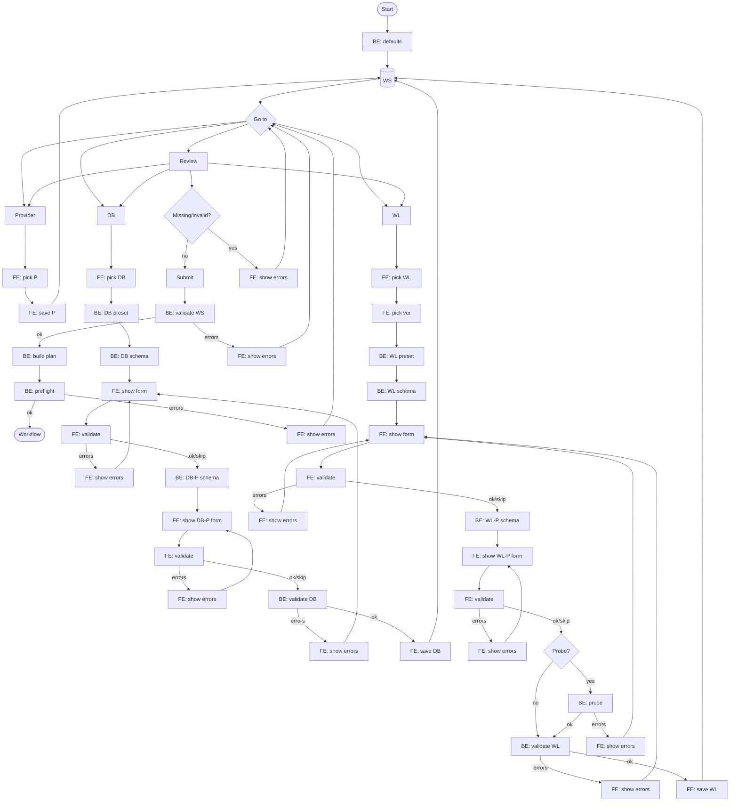

# Wizard graph

## Glossary

- `WS` - wizard state. Stores provider, database, workload, presets, and provider-specific settings.
- `P` - provider, for example Docker or Yandex Cloud.
- `DB` - database section.
- `WL` - workload section.
- `DB-P` - provider-specific database settings.
- `WL-P` - provider-specific workload settings.
- `preset` - settings returned by BE for a selected database or workload.
- `schema` - form schema returned by BE.
- `ok/skip` - user can accept defaults and skip manual editing.
- `Probe?` - Stroppy probe is optional and runs only when required by selected workload/version/settings.
